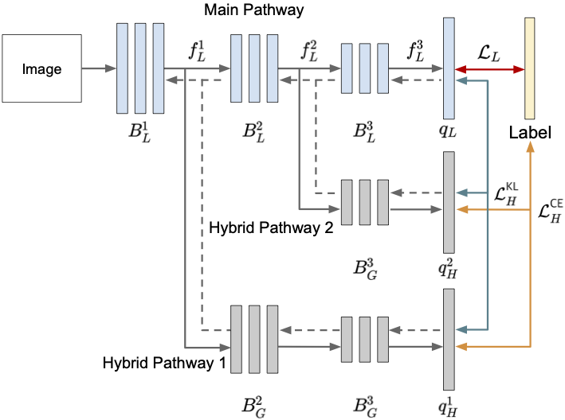

# Multi-Level Branched Regularization for Federated Learning

Official implementation of **Multi-Level Branched Regularization for Federated Learning**, Jinkyu Kim&ast;, Geeho Kim&ast;, Bohyung Han (&ast; equal contribution) in *ICML* 2022

[Paper]() | [Project Page](http://cvlab.snu.ac.kr/research/FedMLB/) 


<div>

</div>
This repository provides detailed information for reproducing results presented in the paper, including clients data splits, hyperparameters and model.

## :gear: Setup
### Dependencies
This repository is implemented based on Pytorch, and the required packages are specified in ```environment.yaml```

### Environment
We test the code on virtual environment with Anaconda on Ubuntu 16.04.
Create the virtual environment by importing the dependencies with the command
 ```
 conda env create -f environment.yaml -n fedmlb
 conda activate fedmlb
 ```

## :computer: Training models from scratch


### Non-iid data (Dirichlet 0.3) on CIFAR-100
100 clients, 5% participation, 1000 rounds communication, 5 local epochs, and ResNet18
```
python federated_train.py --cuda_visible_device 0 --method FedMLB --arch=ResNet_FedMLB  --mode dirichlet --dirichlet_alpha 0.3  --global_epochs 1000 --local_epochs 5  --lr 0.1 --learning_rate_decay 0.998 --weight_decay 1e-3 --seed 0 --set CIFAR100  --workers 8  --alpha 0 --participation_rate=0.05 --learning_rate_decay 0.998 --num_of_clients=100   --batch_size=50
```


## :label: Citation
If you use our code for your work, please cite our paper as below:
```
@InProceedings{Kim2022Multi,
    author    = {Kim, Jinkyu and Kim, Geeho and Han, Bohyung},
    title     = {Multi-Level Branched Regularization for Federated Learning},
    booktitle = {International Conference on Machine Learning},
    year      = {2022},
    organization={PMLR}
}
```

## Acknowledgement
Part of our code is borrowed from the [Pytorch implementation of vanilla federated learning framework](https://github.com/AshwinRJ/Federated-Learning-PyTorch)

